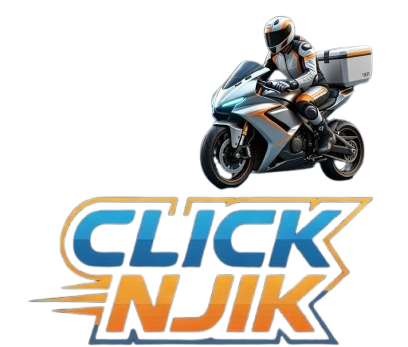

# Click Njik - Landing Page



Une landing page moderne et immersive pour **Click Njik**, service de livraison à domicile de produits alimentaires à Rabat, Salé et Kénitra.

## 🌟 Fonctionnalités

- **Design 3D** avec effets de profondeur et perspective
- **Animations fluides** et transitions élégantes
- **Effet de particules** flottantes
- **Tilt 3D** sur les cartes interactives
- **Compteurs animés** pour les statistiques
- **Slider de témoignages** automatique
- **Formulaire de contact** fonctionnel
- **Navigation fluide** avec scroll spy
- **Effet de vague** dans la section CTA
- **Effet confetti** sur les boutons
- **Text scramble** sur les titres
- **Effet liquide** sur les boutons

## 🎨 Sections

1. **Hero** - Présentation avec statistiques animées
2. **Features** - 6 avantages clés avec effet 3D
3. **About** - Présentation de l'entreprise
4. **Services** - 3 gammes (Standard, Premium, Exclusive)
5. **How It Works** - Processus en 4 étapes
6. **App** - Téléchargement de l'application
7. **Testimonials** - Avis clients
8. **CTA** - Appel à l'action
9. **Contact** - Formulaire et informations
10. **Footer** - Liens et réseaux sociaux

## 🔗 Réseaux Sociaux

- **Instagram**: [https://www.instagram.com/clicknjik](https://www.instagram.com/clicknjik?utm_source=qr&igsh=MXJqOHEzbXJtYWx6eA==)
- **TikTok**: [https://www.tiktok.com/@clicknjik](https://www.tiktok.com/@clicknjik?_r=1&_t=ZS-945haLVtnsY)

## 📁 Structure des Fichiers

```
click-njik-landing/
├── index.html          # Page principale
├── css/
│   └── style.css       # Styles avec effets 3D
├── js/
│   └── main.js         # Interactions et animations
├── images/
│   ├── logo.png        # Logo Click Njik
│   ├── hero-bg.jpg     # Image hero
│   ├── family-delivery.jpg
│   ├── app-mockup.jpg
│   ├── gamme-standard.jpg
│   ├── gamme-premium.jpg
│   └── gamme-exclusive.jpg
└── README.md
```

## 🚀 Déploiement sur GitHub Pages

1. Créez un nouveau repository sur GitHub
2. Uploadez tous les fichiers (maintenez la structure des dossiers)
3. Allez dans **Settings** > **Pages**
4. Sélectionnez la branche **main** et le dossier **root**
5. Cliquez sur **Save**
6. Votre site sera disponible à `https://votre-username.github.io/nom-du-repo`

## 💻 Technologies Utilisées

- **HTML5** - Structure sémantique
- **CSS3** - Animations 3D, Grid, Flexbox
- **JavaScript** - Interactions et animations
- **Font Awesome** - Icônes
- **Google Fonts** - Police Poppins

## 📱 Responsive

Le site est entièrement responsive et fonctionne sur :
- Desktop (1280px+)
- Tablet (768px - 1024px)
- Mobile (< 768px)

## 🎨 Couleurs

- **Primary**: #22c55e (Vert)
- **Secondary**: #f97316 (Orange)
- **Accent**: #06b6d4 (Cyan)
- **Dark**: #0f172a (Bleu foncé)

## 📞 Contact

- **Téléphone**: +212 600 000 000
- **Email**: contact@clicknjik.ma
- **Zone**: Rabat - Salé - Kénitra

---

© 2026 Click Njik. Tous droits réservés.
